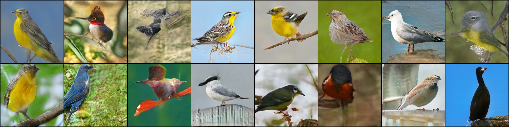
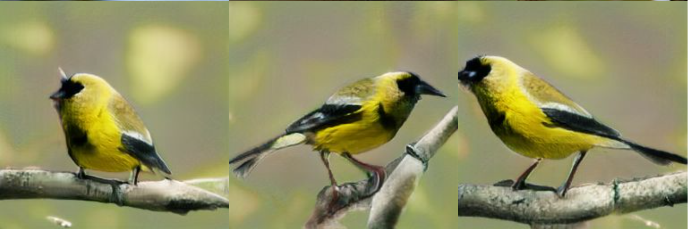
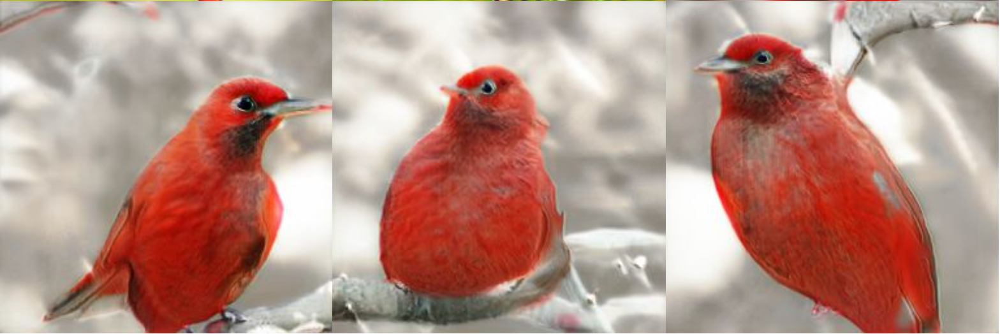
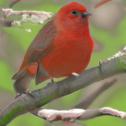
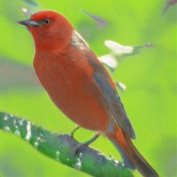

# Deep Fusion Generative Adversarial Networks for Text-to-Image Synthesis

A PyTorch implementation of
[Deep Fusion GAN](https://arxiv.org/abs/2008.05865)
by *Ming Tao, Hao Tang, Songsong Wu, Nicu Sebe, Xiaoyuan Jing, Fei Wu, Bingkun Bao*.

## Dependencies
Dependencies:
```shell
python~=3.7.9
torch~=1.8.0
numpy~=1.21.4
pandas~=1.2.2
torchvision~=0.9.0
Pillow~=7.2.0
matplotlib~=3.3.4
tqdm~=4.62.3
```

To install required packages use:
```shell
pip install -r requirements.txt
```

## Experiments

Use `train_example.ipynb`, `metrics_evaluation.ipynb` and `eval_example.ipynb` to train, eval and generation.

## Deep Fusion GAN architecture

<p align="center">
 
</p>

<div align="center">
  <b>The architecture of the proposed DF-GAN for text-to-image synthesis. DF-GAN generates high-resolution images directly by one pair of generator and discriminator and fuses the text information and visual feature maps through multiple Deep text-image Fusion Blocks (DFBlock) in UPBlocks.</b>
</div>

## Losses per first 100 epoch

<p align="center">
 
</p>

## Metrics per epochs

<p align="center">
 
</p>

## Final metrics

|         | Ours  | Paper |
|---------|-------|-------|
| IS      | 4.43  | 5.10  |
| FID     | 18.10 | 21.42 |

## Examples of generation

### Common sample

<p align="center">
 
</p>

<div align="center">
  <b>Example of sixteen generated birds.</b>
</div>

### A small yellow bird with black wings and crown

<p align="center">
 
</p>

### This bird has wings that are red and has an orange bill

<p align="center">
 
</p>

### A small yellow bird with green wings

<p align="center">
 
</p>

### A small red bird has grey wings

<p align="center">
 
</p>

### A small red bird has grey *long* wings

<p align="center">
 
</p>