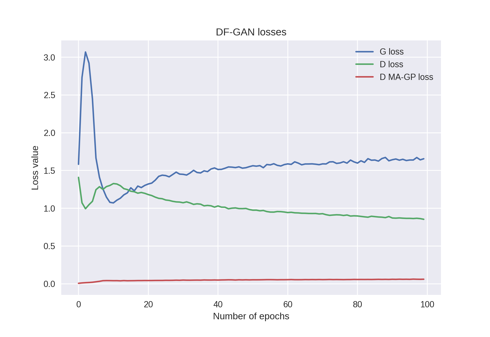
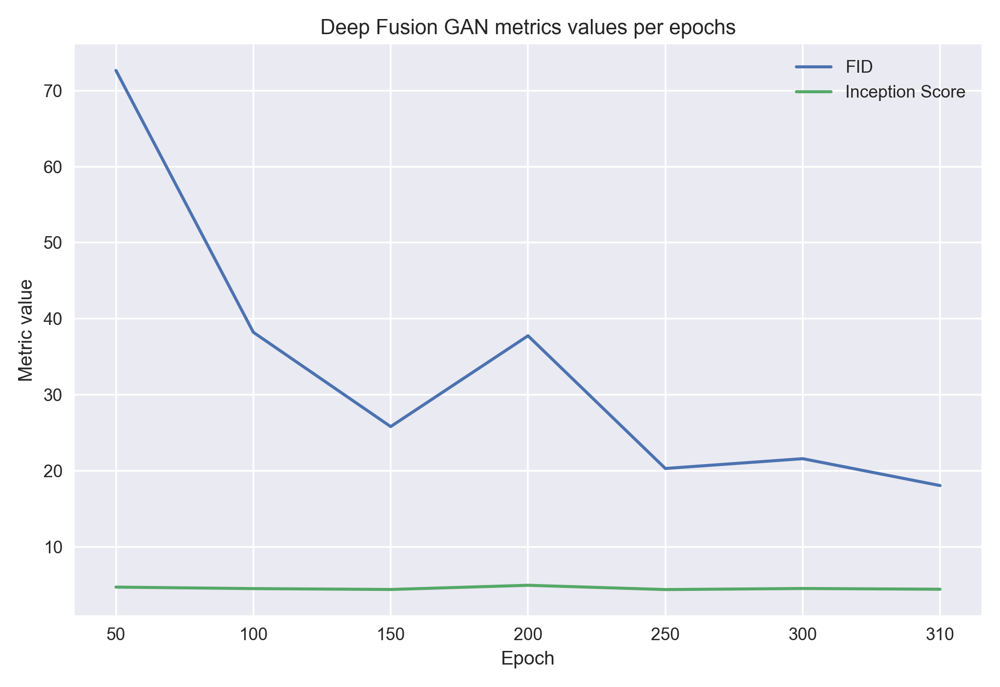

# Deep Fusion Generative Adversarial Networks for Text-to-Image Synthesis

A PyTorch implementation of 
[Deep Fusion GAN](https://arxiv.org/abs/2008.05865) 
by *Ming Tao, Hao Tang, Songsong Wu, Nicu 
Sebe, Xiaoyuan Jing, Fei Wu, Bingkun Bao*.

## Deep Fusion GAN architecture

 

  <b>The architecture of the proposed DF-GAN for text-to-image synthesis. DF-GAN generates high-resolution images directly by one pair of generator and discriminator and fuses the text information and visual feature maps through multiple Deep text-image Fusion Blocks (DFBlock) in UPBlocks.</b>

## Losses per first 100 epoch

 

## Metrics per epochs

 

## Final metrics

|         | Ours  | Paper |
|---------|-------|-------|
| IS      | 4.43  | 5.10  |
| FID     | 18.10 | 21.42 |

## Examples of generation